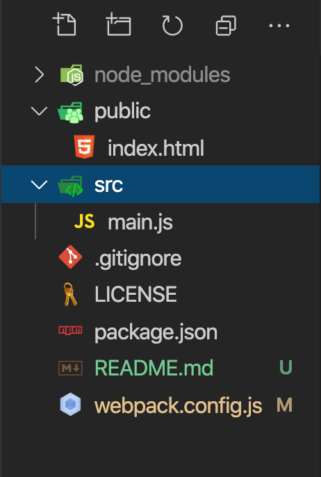

# 手把手入门Webpack搭建vue开发环境

1. 新建文件夹

   ```terminal
   mkdir webpack-demo && cd webpack-demo
   ```

2. 创建package.js文件

   ```terminal
   npm init -y     修改 "main": "index.js", 改为 "private": true,
   ```

3. 安装webpack(tips: 当前版本webpack4.x)

   ```terminal
   npm install webpack webpack-cli --save-dev
   ```

4. 根目录下新建public和src文件夹分别放入index.html和main.js（如图）

   

5. 根目录下创建webpack.config.js

   ```javascript
   // webpack基础入门四要素写好
   module.exports = {
     entry: "", // 入口文件
     output: {}, // 打包输出文件
     plugins: [], // 插件
     module: {} // 模块
   }
   ```

6. 开始入门配置

   - 写好入口文件

     ```javascript
     const path = require("path")
     module.exports = {
     	entry: path.resolve(__dirname, "src/main")
     	// other code
     }
     ```

   - 写好输出文件

     ```javascript
     const path = require("path")
     module.exports = {
       // entry...
       output: {
         path: path.resolve(__dirname, "dist"),
         filename: "bundle.js"
       }
       // other code
     }
     ```

   - 配置模块对应的loader

     ```javascript
     module.exports = {
       // entry...
       // output...
       module: {
         rules: [
           // 为了能使用es6语法，我们需要对.js文件使用babel转译
           // 需要安装包 npm install babel-loader @babel/core @babel/presets-env --save-dev
           { 
             test: /\.js$/,
             exclude: /node_modules/, // node_modules 文件夹内的js文件不在转译范围内
            	use: {
               loader: "babel-loader",
               options: {
                 presets: ["@babel/preset-env"]
               }
           	}
           },
           // .vue文件使用官方vue-loader  
           // npm install vue-loader --save-dev
           { test: /\.vue$/, use: "vue-loader" }, 
           //.vue文件可以在<style></style>标签内写入样式，故引入style-loader
           // npm install css-loader vue-style-loader --save-dev
           { test: /\.css$/, use: ["css-loader", "vue-style-loader"] }
           // 其他配置不再赘述
         ]
       }
     }
     ```

   - 写入插件

     ```javascript
     const path = require("path")
     const HtmlWebpackPlugin = require("html-webpack-plugin")
     const VueLoaderPlugin = require("vue-loader/lib/plugin")
     module.exports = {
       // other code
       plugins: [
     		// 打包后生成index.html文件，以public目录下的index.html作为模版    
         new HtmlWebpackPlugin({
           template: path.resolve(__dirname, "public/index.html")
         }),
         // 由于.vue文件中的template是
         new VueLoaderPlugin()
       ]
     }
     ```

7. 写入代码

   - /public/index.html

     ```html
     <!DOCTYPE html>
     <html lang="en">
     <head>
       <meta charset="UTF-8">
       <meta name="viewport" content="width=device-width, initial-scale=1.0">
       <title>webpack-vue-demo</title>
     </head>
     <body>
       <div id="app"></div>
     </body>
     </html>
     ```

   - /src/main.js

     ```javascript
     // 自行安装vue npm install vue --save
     import Vue from "vue"
     import App from "./App.vue"
     new Vue({
       render: h => h(App)
     }).$mount("#app")
     ```

8. 安装webpack-dev-server vue-template-compiler

   ```terminal
   npm install webpack-dev-server vue-template-compiler --save-dev
   ```

9. 修改package.json文件

   ```json
   {
     "script": {
       "dev": "webpack-dev-server --open",
       "build": "webpack --production"
     }
   }
   ```

   

